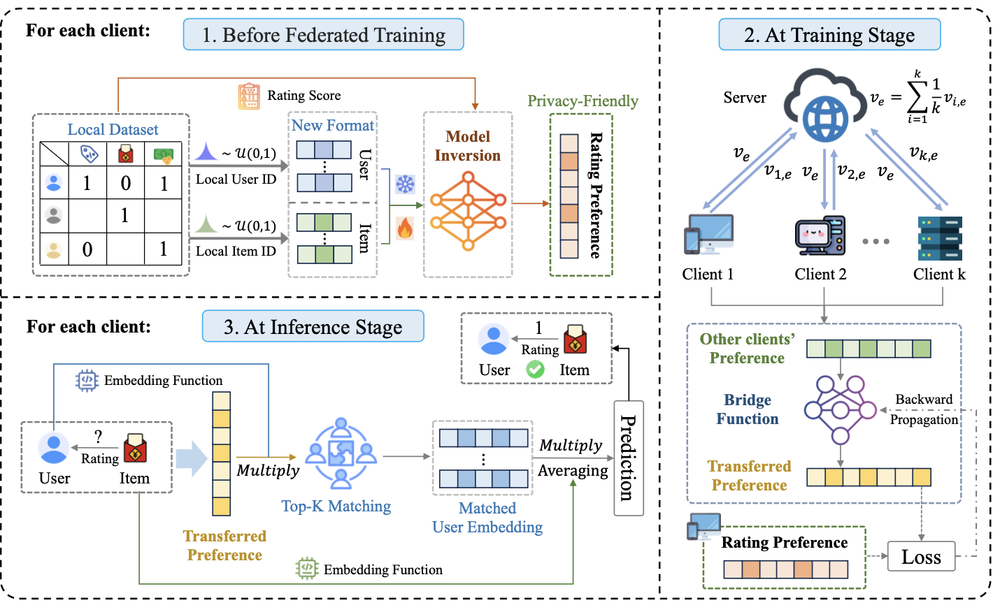

Hi, my name is Yichen Li (Chinese: 李亦晨), a Ph.D. Candidate (3rd year student, 2023.09-2028.01) in the School of Computer Science and Technology at Huazhong University of Science and Technology (HUST), advised by [Prof. Ruixuan Li](https://idc.hust.edu.cn/rxli/index.htm) and [Prof. Haozhao Wang](https://wanghaozhao.mysxl.cn/). Meanwhile, I am also a visiting student at Mohamed bin Zayed University of Artificial Intelligence (MBZUAI). I also work closely with [Prof. Rui Zhang](https://www.ruizhang.info/) from HUST, and [Prof. Wenchao Xu](https://huasion23.github.io/) from HKUST. 

**<ins>❤️‍🔥🔜: I am seeking opportunities to serve as a Visiting Scholar, with aspirations for a future role as a Postdoc (2 years later) ! ! !</ins>**

## 📖 Research
I am passionate about **distributed learning** among mobile devices. My current research interests focus on five key areas:
- **<ins>⭐ Federated Continual / Incremental / Life-Long Learning</ins>** 
- Federated Learning (**_e.g.,_** Knowledge Distillation, Model Aggregation...)
- (Federated) Recommendation System (**_e.g.,_** Sequential RecSys, Cold-Start Problem)
- (Federated) Software Engineering (**_e.g.,_** Defect Prediction, Code Smell Detection)
- Edge-Cloud Model Collaboration (**_e.g.,_** Multi-Agent Sys, RAG)

**PS: If you are interested in collaborating with me or want to have a chat, always feel free to contact me through e-mail or <ins>Wechat</ins>: ycli_hust**

## 🔥 News
- 2025.12: 🎉🎉 Granted by the Youth Talents Support Project from China Association for Science and Technology!
- 2025.12: 🎉🎉 Granted by the Fundamental Research Project for Young Professional from NSFC!
- 2025.11: 🎉🎉 Three papers were accepted by AAAI'26 with 1 Oral!
- 2025.09: 🎉🎉 Four papers were accepted by NeurIPS'25 with 1 Spotlight!
- 2025.05: 🎉🎉 One paper was accepted by ICML'25 (Spotlight)!
- 2025.05: 🎉🎉 One paper was accepted by IEEE COMST (IF=46.7, Top 1 in IEEE)!
- 2025.04: 🎉🎉 Granted by the Fundamental Research Funds for the Central Universities!
- 2025.03: 🎉🎉 One paper was accepted by IEEE TPAMI (IF=18.6, Top 3 in IEEE)!
- 2025.01: 🎉🎉 One paper was accepted by WWW'25.
- 2025.01: 🎉🎉 I became a Ph.D. Candidate!
- 2024.12: 🎉🎉 One paper was accepted by JSEP (Corresponding Author).
- 2024.07: 🎉🎉 One paper was accepted by IEEE TPDS.
- 2024.07: 🎉🎉 One paper was accepted by ECCV'24.
- 2024.03: 🎉🎉 One paper was accepted by CVPR'24.
- 2024.01: 🎉🎉 One paper was accepted by ICLR'24 (Co-author).
- 2023.09: 🎉🎉 Join the HUST as a Ph.D. Student!
- 2023.03: 🎉🎉 One paper was accepted by CVPR'23.

## 📝 Publications
<dl>
<dt>
</dt>
<dd><a href="https://arxiv.org/pdf/2412.13840"><strong>	
Unleashing the Power of Continual Learning on Non-Centralized Devices: A Survey
</strong></a></dd>
<dd><strong>Yichen Li</strong>, Haozhao Wang, Wenchao Xu, Tianzhe Xiao, Hong Liu, Minzhu Tu, Yuying Wang, Xin Yang, Rui Zhang, Shui Yu, Song Guo, Ruixuan Li.</dd>
<dd> IEEE Communications Surveys & Tutorials (<strong>COMST</strong>), 2025, <strong>Q1 (Rk=1/168 IEEE, IF=46.7)</strong></dd>
</dl>
 
 
 

***

<dl>
<dt>
</dt>
<dd><a href="https://ieeexplore.ieee.org/abstract/document/10930690"><strong>	
Re-Fed+: A Better Replay Strategy for Federated Incremental Learning
</strong></a></dd>
<dd><strong>Yichen Li</strong>, Haozhao Wang, Yining Qi, Wei Liu, Ruixuan Li</dd>
<dd>IEEE Transactions on Pattern Analysis and Machine Intelligence (<strong>TPAMI</strong>), 2025, <strong>CCF-A (Rk=3/168 IEEE, IF=18.6)</strong></dd>
</dl>
 
 

***

<dl>
<dt>
</dt>
<dd><a href="https://arxiv.org/pdf/2412.13779"><strong>	
FedSSI: Rehearsal-Free Continual Federated Learning with Synergistic Synaptic Intelligence
</strong></a></dd>
<dd><strong>Yichen Li</strong>, Yuying Wang, Haozhao Wang, Yining Qi, Tianzhe Xiao, Ruixuan Li</dd>
<dd> The Thirteenth International Conference on Learning Representations (<strong>ICML'25</strong>), 2025, <strong>CCF-A (Spotlight)</strong></dd>
</dl>
 

***

<dl>
<dt>
</dt>
<dd><a href="None"><strong>	
Efficient Knowledge Transfer in Federated Recommendation for Joint Venture Ecosystem
</strong></a></dd>
<dd><strong>Yichen Li</strong>, Yijing Shan, Yi Liu, Haozhao Wang, Cheng Wang, Wei Wang, Yi Wang, Ruixuan Li</dd>
<dd> The Thirty-Ninth Annual Conference on Neural Information Processing Systems (<strong>NeurIPS'25</strong>), 2025, <strong>CCF-A (Spotlight)</strong></dd>
</dl>
 
 
 

***

<dl>
<dt>
</dt>
<dd><a href="https://openaccess.thecvf.com/content/CVPR2024/papers/Li_Towards_Efficient_Replay_in_Federated_Incremental_Learning_CVPR_2024_paper.pdf"><strong>	
Towards Efficient Replay in Federated Incremental Learning
</strong></a></dd>
<dd><strong>Yichen Li</strong>, Qunwei Li, Haozhao Wang, Ruixuan Li, Wenliang Zhong, Guannan Zhang</dd>
<dd> The Thirty-Fifth IEEE/CVF Conference on Computer Vision and Pattern Recognition (<strong>CVPR'24</strong>), 2024, <strong>CCF-A</strong></dd>
</dl>

 

***

### Conference Publication
1. **Yichen Li**, Yichen Tan, Yijing Shan, Haozhao Wang, Rui Zhang, Imran Razzak, Ruixuan Li. Data-Centric Sequential Recommendation with Relation-Augmented Generation. The 40th Annual AAAI Conference on Artificial Intelligence (AAAI'26) **(CCF-A)**
2. **Yichen Li**, Hang Su, Huifa Li, Haolin Yang, Xinlin Zhuang, Haochen Xue, Haozhao Wang, Imran Razzak. FedCD: Towards Consolidated Distillation for Heterogeneous Federated Learning. The 40th Annual AAAI Conference on Artificial Intelligence (AAAI'26) **(CCF-A)**
3. Qiyu Qin, **Yichen Li**, Haozhao Wang, Cheng Wang, Rui Zhang, Ruixuan Li. Unbiased Rectification for Sequential Recommender Systems under Fake Orders. The 40th Annual AAAI Conference on Artificial Intelligence (AAAI'26), Oral **(CCF-A)**
4. **Yichen Li**, Yijing Shan, Yi Liu, Haozhao Wang, Cheng Wang, Wei Wang, Yi Wang, Ruixuan Li. [Efficient Knowledge Transfer in Federated Recommendation for Joint Venture Ecosystem](https://openreview.net/forum?id=ZWOe1kkufx). The Thirty-Ninth Annual Conference on Neural Information Processing Systems (NeurIPS'25), Spotlight **(CCF-A)**
5. **Yichen Li**, Yuying Wang, Jiahua Dong, Haozhao Wang, Yining Qi, Rui Zhang, Ruixuan Li. [Resource-Constrained Federated Continual Learning: What Does Matter?](https://arxiv.org/pdf/2501.08737?). The Thirty-Ninth Annual Conference on Neural Information Processing Systems (NeurIPS'25) **(CCF-A)**
6. **Yichen Li**, Xiuying Wang, Wenchao Xu, Haozhao Wang, Yining Qi, Jiahua Dong, Ruixuan Li. [Feature Distillation is the Better Choice for Model-Heterogeneous Federated Learning](https://openreview.net/forum?id=xYik0sKYVo). The Thirty-Ninth Annual Conference on Neural Information Processing Systems (NeurIPS'25) **(CCF-A)**
7. Tianzhe Xiao, **Yichen Li**, Yining Qi, Yi Liu, Wei Wang, Haozhao Wang, Yi Wang, Ruixuan Li. [Enhancing Privacy in Multimodal Federated Learning with Information Theory](https://openreview.net/forum?id=UlpAIz6o5u). The Thirty-Ninth Annual Conference on Neural Information Processing Systems (NeurIPS'25) **(CCF-A)**
8. **Yichen Li**, Yuying Wang, Haozhao Wang, Yining Qi, Tianzhe Xiao, Ruixuan Li. [FedSSI: Rehearsal-Free Continual Federated Learning with Synergistic Synaptic Intelligence](https://arxiv.org/pdf/2412.13779). The Thirteenth International Conference on Learning Representations (ICML'25), Spotlight **(CCF-A)**
9. **Yichen Li**, Yijing Shan, Yi Liu, Haozhao Wang, Wei Wang, Yi Wang, Ruixuan Li. [Personalized Federated Recommendation for Cold-Start Users via Adaptive Knowledge Fusion](https://openreview.net/pdf?id=bhWngwuo74). The 34th ACM Web Conference (WWW'25), Australia, 2025 **(CCF-A)**
10. **Yichen Li**, Wenchao Xu, Haozhao Wang, Ruixuan Li, Yining Qi, Jingcai Guo. [Personalized Federated Domain-Incremental Learning based on Adaptive Knowledge Matching](https://arxiv.org/pdf/2407.05005). The Eighteenth European Conference on Computer Vision (ECCV'24), Italy, 2024 **(CAAI-A)**
11. **Yichen Li**, Qunwei Li, Haozhao Wang, Ruixuan Li, Wenliang Zhong, Guannan Zhang. [Towards Efficient Replay in Federated Incremental Learning](https://openaccess.thecvf.com/content/CVPR2024/papers/Li_Towards_Efficient_Replay_in_Federated_Incremental_Learning_CVPR_2024_paper.pdf). The Thirty-Fifth IEEE/CVF Conference on Computer Vision and Pattern Recognition (CVPR'24), USA, 2024 **(CCF-A)**
12. Haozhao Wang\*, Haoran Xu\*, **Yichen Li\***, Ruixuan Li, Tianwei Zhang. [FedCDA: Federated Learning with Cross-rounds Divergence-aware Aggregation](https://openreview.net/pdf?id=nbPGqeH3lt). Twelfth International Conference on Learning Representations (ICLR'24), Austria, 2024 (Co-author) **(CAAI-A)**
13. Haozhao Wang, **Yichen Li**, Wenchao Xu, Ruixuan Li, Yufeng Zhan, Zhigang Zeng. [DaFKD: Domain-aware Federated Knowledge Distillation](http://openaccess.thecvf.com/content/CVPR2023/papers/Wang_DaFKD_Domain-Aware_Federated_Knowledge_Distillation_CVPR_2023_paper.pdf). The Thirty-Fourth IEEE/CVF Conference on Computer Vision and Pattern Recognition (CVPR'23), Canada, 2023 **(CCF-A)**
14. Tianzhe Xiao, **Yichen Li**, Yu Zhou, Yining Qi, Yi Liu, Wei Wang, Haozhao Wang, Yi Wang, Ruixuan Li. [FedRE: Robust and Effective Federated Learning
with Privacy Preference](https://arxiv.org/pdf/2505.04889). The ACM International Conference on Multimedia Retrieval (ICMR'25), USA, 2025 (Co-author) **(CCF-B)**
<!--8. Juan Zhao, Xiaoquan Yi, Ruixuan Li, Yuhua Li, Haozhao Wang, **Yichen Li**, Zhiying Deng, Zijun Xu. [FedTA: Unsupervised Federated Prototype Learning with Temperature Adaptation](http://www.ieee-hust-ncc.org/2024/ICESS/Presentation%20Program.pdf). IEEE International Conference on High Performance Computing and Communications (HPCC'24), China, 2024 **(CCF-C)**-->
15. Hao Zhu, **Yichen Li**, Jie Li, Xiaofang Zhang. [An Efficient Design Smell Detection Approach with Inter-class Relation](https://ksiresearch.org/seke/seke23paper/paper208.pdf). The 35th International Conference on Software Engineering and Knowledge Engineering (SEKE'23), USA, 2023 **(CCF-C)**
16. **Yichen Li**, Xiaofang Zhang. [Multi-Label Code Smell Detection with Hybrid Model based on Deep Learning](http://ksiresearch.org/seke/seke22paper/paper077.pdf). The 34th International Conference on Software Engineering and Knowledge Engineering (SEKE'22), USA, 2022 **(CCF-C)**
   
***

### Journal Publications 
1. **Yichen Li**, Haozhao Wang, Wenchao Xu, Tianzhe Xiao, Hong Liu, Minzhu Tu, Yuying Wang, Xin Yang, Rui Zhang, Shui Yu, Song Guo, Ruixuan Li. [Unleashing the Power of Continual Learning on Non-Centralized Devices: A Survey](https://arxiv.org/pdf/2412.13840). IEEE Communications Surveys & Tutorials (COMST) **(Q1, Top 1/168 in IEEE, IF=46.7)**
2. **Yichen Li**, Haozhao Wang, Yining Qi, Wei Liu, Ruixuan Li. [Re-Fed+: A Better Replay Strategy for Federated Incremental Learning](https://ieeexplore.ieee.org/abstract/document/10930690). IEEE Transactions on Pattern Analysis and Machine Intelligence (TPAMI), 2025 **(CCF-A, Top 3/168 in IEEE, IF=18.6)**
3. **Yichen Li**, Wenchao Xu, Yining Qi, Haozhao Wang, Ruixuan Li, Song Guo. [SR-FDIL: Synergistic Replay for Federated Domain-Incremental Learning](https://ieeexplore.ieee.org/abstract/document/10620614). IEEE Transactions on Parallel and Distributed Systems (TPDS), 2024 **(CCF-A)**
4. Yuying Wang, **Yichen Li†**, Haozhao Wang, Lei Zhao, Xiaofang Zhang†. [Better Knowledge Enhancement for Privacy-Preserving Cross-Project Defect Prediction](https://arxiv.org/pdf/2412.17317). Journal of Software: Evolution and Process (JSEP), 2024 (Corresponding Author) **(CCF-B)**
5. Jianian Zhu, **Yichen Li**, Haozhao Wang, Yining Qi, Ruixuan Li. [Hypernetwork-Driven Centralized Contrastive Learning for Federated Graph Classification](https://www.researchsquare.com/article/rs-3887032/latest.pdf). World Wide Web Journal (WWWJ), 2024 **(CCF-B)**
6. **Yichen Li**, An Liu, Lei Zhao, Xiaofang Zhang. [Hybrid model with multi-level code representation for multi-label code smell detection](https://drive.google.com/file/u/0/d/15fFOKyOnworRGOhDd_dCSmjN8obxEh0C/view). International Journal of Software Engineering and Knowledge Engineering (IJSEKE), 2022 **(CCF-C)**

## 🙂 Preprint
1. **Yichen Li**, Wenchao Xu, Yuying Wang, Yining Qi, Haozhao Wang, Bo Liu, Jingcai Guo, Ruixuan Li. Personalized Federated Incremental Learning with Chunked Hypernetworks. Submitted to IEEE Transactions on Parallel and Distributed Systems (TPDS) **(CCF-A)**
2. **Yichen Li**, Qiyu Qin, Gaoyang Zhu, Wenchao Xu, Haozhao Wang, Yuhua Li, Rui Zhang, Ruixuan Li. [A Systematic Survey on Federated Sequential Recommendation](https://arxiv.org/pdf/2504.05313). Arxiv
3. **Yichen Li**, Haozhao Wang, Hang Su, Yulong Li, Xiaoquan Yi, Yankai Jiang, Abdalla Swikir, Imran Razzak, Ruixuan Li. C2-AFCL: Cross-task Calibration for Asynchronous Federated Continual Learning. Submitted to The Fourteenth International Conference on Learning Representations (ICLR'26) **(CAAI-A)**
4. Jialin Wu*, **Yichen Li\***, Haozhao Wang, Jianian Zhu, Shiwei Li, Bo Liu, Rui Zhang, Ruixuan Li. Breaking Static Paradigms: A Mutual Evolution Framework for Edge-Cloud Model Collaboration. Submitted to The Fourteenth International Conference on Learning Representations (ICLR'26) **(CAAI-A)**
5. Hang Su, Yijun Mo, Zhiyu Zhang, Yankai Jiang, Bo Liu, Abdalla Swikir, **Yichen Li†**. Data-free Calibration for Federated Continual Learning under Asynchronous Concept Drift. Submitted to The Web Conference 2026 (WWW'26) **(CCF-A)**
6. Xiuying Wang, **Yichen Li†**, Hang Su, Gaozhuo Liu, Shiwei Li, Huifa Li, Imaran Razzak. Lightweight Federated Incremental Learning via Decoupled Replay. Submitted to The IEEE/CVF Conference on Computer Vision and Pattern Recognition 2026 (CVPR'26) **(CCF-A)**
7. Xinlin Zhuang, **Yichen Li**, Xiwei Liu, Haolin Yang, Yifan Lu, Ziyun Zou, Yulong Li, Huifa Li, Dongliang Chen, Qinglei Wang, Weiyang Liu, Ying Qian, Jiangming Shi, Imran Razzak. CHIPS: Efficient CLIP Adaptation via Curvature-aware Hybrid Influence-based Data Selection. Submitted to The IEEE/CVF Conference on Computer Vision and Pattern Recognition 2026 (CVPR'26) **(CCF-A)**
8. Qiyu Qin, **Yichen Li**, Hao Wu, Yuntao Zou, Rui Zhang and Ruixuan Li. Forgetting without Breaking: Structure-aware Unlearning for Sequential Recommender Systems. Submitted to The Web Conference 2026 (WWW'26) **(CCF-A)**
9. Tianzhe Xiao, **Yichen Li**, Yining Qi, Haozhao Wang, Ruixuan Li. [FedGIG: Graph Inversion from Gradient in Federated Learning](https://arxiv.org/pdf/2412.18513). Submitted to the 2026 IEEE International Conference on Acoustics, Speech, and Signal Processing (ICASSP'26) **(CCF-B)**

<!--9. Jiahua Dong, Wenqi Liang, Yang Cong, **Yichen Li**, Hongyuan Yu, Henghui Ding, Yulun Zhang, Salman Khan and Fahad Shahbaz Khan. Task Relevance-Driven Prompt Expansion
for Federated Continual Learning. Submitted to IEEE Transactions on Pattern Analysis and Machine Intelligence (TPAMI) **(CCF-A)**
10. Lingxiao Kong, Wenchao Xu, Chenran Zhang, Lei Wu, Haozhao Wang, **Yichen Li**, Ruixuan Li. SplitFed: Feature-Based Defense against Byzantine Attacks in Split Learning. Submitted to Neural Networks (NN) **(CCF-B)**-->

## 🏆 Honor & Award
- 2025.12 Granted by the Youth Talents Support Project from China Association for Science and Technology, (<ins>中国科协青年科技人才培育工程博士生专项计划</ins>), FIRST student in the School of Computer Sci. & Tech., HUST, China
- 2025.12 Granted by the Fundamental Research Project for Young Professional from NSFC, (<ins>国家自然科学基金青年学生基础研究项目（博士研究生)</ins>), FIRST student in the School of Computer Sci. & Tech., HUST, China
- 2025.12 BYD Scholarship (<ins>比亚迪奖学金</ins>), HUST
- 2025.09 National Scholarship for Ph.D. Students (<ins>博士生国家奖学金</ins>), China
- 2025.09 Merit Student (<ins>三好学生</ins>), HUST
- 2025.09 Science and Technology Innovation Award (<ins>科技创新奖</ins>), HUST
- 2025.04 Granted by the Fundamental Research Funds for the Central Universities (<ins>研究生创新基金项目</ins>), Only ONE student in the School of Computer Sci. & Tech., HUST
- 2025.01 Best Paper Award (<ins>最佳论文奖</ins>), [IDC Lab](https://idc.hust.edu.cn/), HUST
- 2025.01 Excellent Paper Award of the 3rdAnnual Academic Conference (<ins>第三届学术年会优秀论文奖</ins>), School of Computer Sci. & Tech., HUST
- 2024.12 Guotai Junan Scholarship (<ins>国泰君安奖学金</ins>), 2 Ph.D. students in the School of Computer Sci. & Tech., HUST
- 2024.10 Doctoral First-Class Academic Scholarship (<ins>博士一等学业奖学金</ins>), HUST
- 2024.10 Science and Technology Innovation Award (<ins>科技创新奖</ins>), HUST
- 2024.10 Merit Student (<ins>三好学生</ins>), HUST
- 2024.04 Sangfor Award (<ins>深信服奖学金</ins>), School of Computer Sci. & Tech., HUST
- 2024.01 Best Paper Award of the 2ndAnnual Academic Conference (<ins>第二届学术年会最佳论文奖</ins>), School of Computer Sci. & Tech., HUST
- 2024.01 Best Newcomer Award (<ins>最佳新人奖</ins>), [IDC Lab](https://idc.hust.edu.cn/), HUST

## 💬 Academic Service
### Conference Committee Member
- Reviewer for ICML'25/26, ICLR'25/26, NeurIPS'24/25
- Reviewer for CVPR'25/26, ICCV'25, ECCV'24
- Reviewer for IJCAI'25, AAAI'25/26, WWW'25/26, KDD'25
  
### Journal Reviewer
- Reviewer for IEEE Transactions on Pattern Analysis and Machine Intelligence (TPAMI)
- Reviewer for IEEE Transactions on Parallel and Distributed Systems (TPDS)
- Reviewer for IEEE Transactions on Knowledge and Data Engineering (TKDE)
- Reviewer for IEEE Transactions on Circuits and Systems for Video Technology (TCSVT)
- Reviewer for ACM Computing Surveys (CSUR)
- Reviewer for ACM Transactions on Information Systems (TOIS)
- Reviewer for ACM Transactions on Software Engineering and Methodology (TOSEM)
- Reviewer for ACM Transactions on Intelligent Systems and Technology (TIST)

