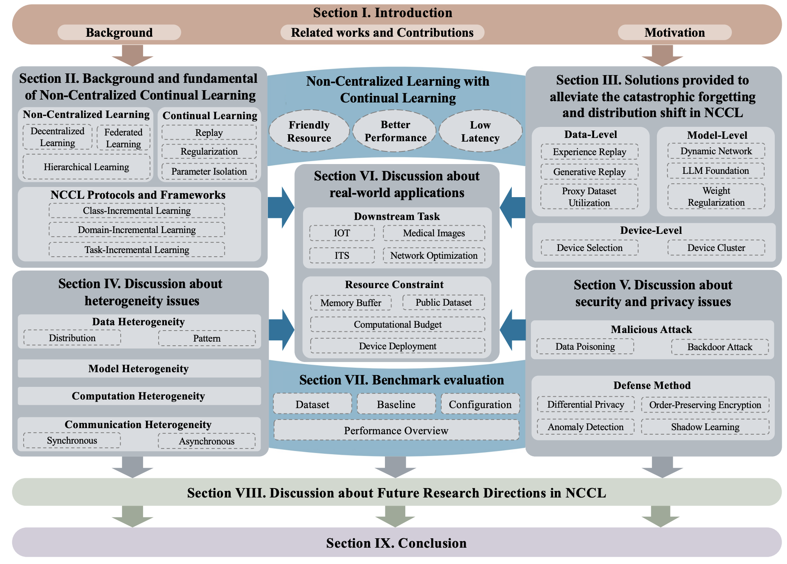
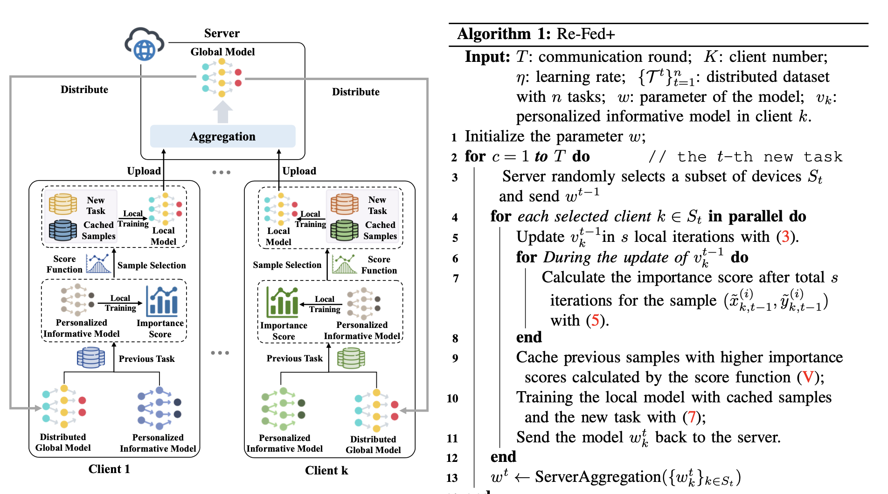
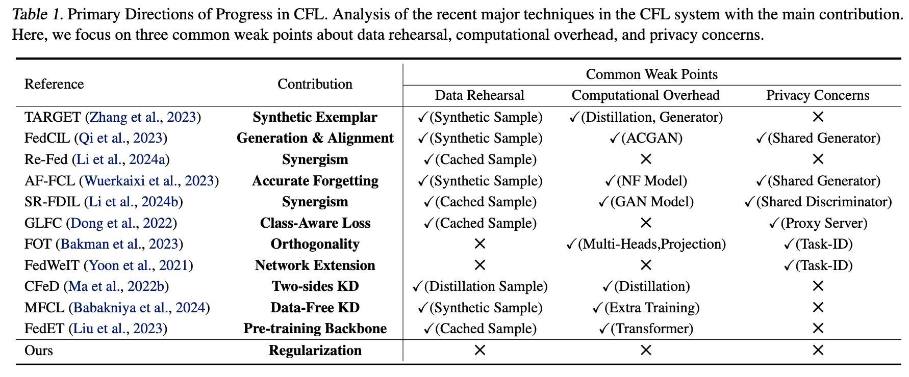
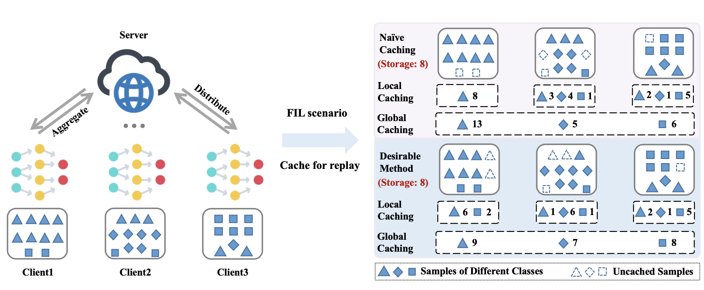
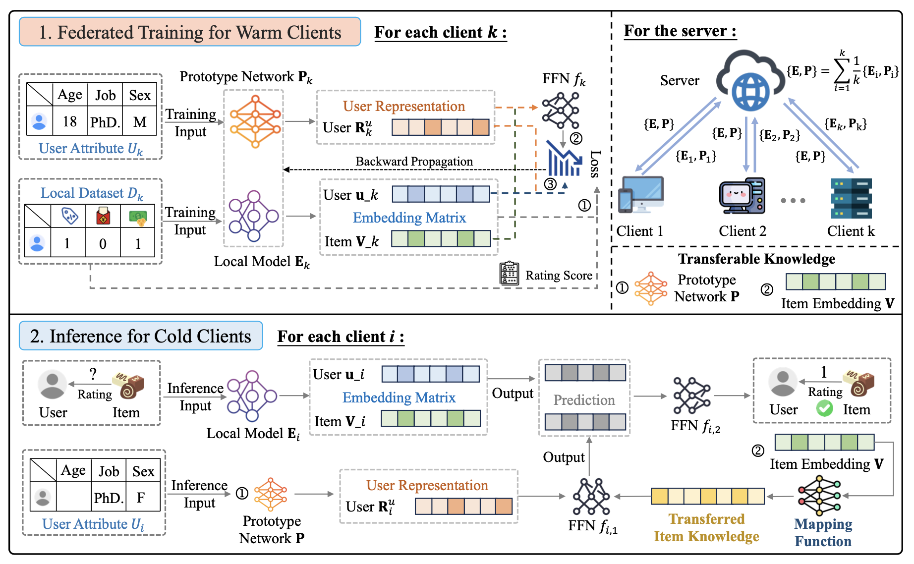

Hi, my name is Yichen Li (Chinese: 李亦晨), a Ph.D. Candidate (2nd year student, 2023.09-2028.06) in the School of Computer Science and Technology at Huazhong University of Science and Technology (HUST), advised by [Prof. Ruixuan Li](https://idc.hust.edu.cn/rxli/index.htm) and [Dr. Haozhao Wang](https://wanghaozhao.mysxl.cn/). Previously, I received my bachelor's degree from the School of Computer Science and Technology at Soochow University in 2023, under the supervision of [Prof. Xiaofang Zhang](https://cn.linkedin.com/in/xiaofang-zhang-28262285). I also work closely with [Prof. Rui Zhang](https://www.ruizhang.info/) from HUST, and [Prof. Wenchao Xu](https://huasion23.github.io/) from HKUST. Recently, I am fortunate to work with [Prof. Song Guo](https://cse.hkust.edu.hk/~songguo/) from HKUST, and [Prof. Shui Yu](https://profiles.uts.edu.au/Shui.Yu) from UTS. 

**<ins>❤️‍🔥🔜: I am seeking opportunities to serve as a Research Assistant, with aspirations for a future role as a Postdoc (2-3 years later) ! ! !</ins>**

## 📖 Research
I am passionate about **distributed learning** among mobile devices. My current research interests focus on five key areas:
- **<ins>⭐ Federated Continual / Incremental / Life-Long Learning</ins>** 
- Federated Learning (**_e.g.,_** Knowledge Distillation, Model Aggregation...)
- (Federated) Recommendation System (**_e.g.,_** Sequential RecSys, Cold-Start Problem)
- (Federated) Software Engineering (**_e.g.,_** Defect Prediction, Code Smell Detection)
- Edge-Cloud Collaboration (**_e.g.,_** Multi-Agent Sys, RAG)

**PS: If you are interested in collaborating with me or want to have a chat, always feel free to contact me through e-mail, <ins>QQ</ins>: 243840749, or <ins>Wechat</ins>: ycli_hust**

## 🔥 News
- 2025.05: 🎉🎉 One paper was accepted by ICML'25 (Spotlight, Score: 4.5/5)!
- 2025.05: 🎉🎉 One paper was accepted by IEEE COMST (IF=35.6, Top 1 in IEEE)!
- 2025.04: 🎉🎉 One project was granted by the Fundamental Research Funds for the Central Universities!
- 2025.04: 🎉🎉 One paper was accepted by ICMR'25.
- 2025.03: 🎉🎉 One paper was accepted by IEEE TPAMI.
- 2025.01: 🎉🎉 One paper was accepted by WWW'25.
- 2025.01: 🎉🎉 I became a Ph.D. Candidate!
- 2024.12: 🎉🎉 One paper was accepted by JSEP (Corresponding Author).
- 2024.07: 🎉🎉 One paper was accepted by IEEE TPDS.
- 2024.07: 🎉🎉 One paper was accepted by ECCV'24.
- 2024.03: 🎉🎉 One paper was accepted by CVPR'24.
- 2024.01: 🎉🎉 One paper was accepted by ICLR'24 (Co-author).
- 2023.09: 🎉🎉 Join the HUST as a Ph.D. Student!
- 2023.03: 🎉🎉 One paper was accepted by CVPR'23.

## 📝 Publications
<dl>
<dt>
</dt>
<dd><a href="https://arxiv.org/pdf/2412.13840"><strong>	
Unleashing the Power of Continual Learning on Non-Centralized Devices: A Survey
</strong></a></dd>
<dd><strong>Yichen Li</strong>, Haozhao Wang, Wenchao Xu, Tianzhe Xiao, Hong Liu, Minzhu Tu, Yuying Wang, Xin Yang, Rui Zhang, Shui Yu, Song Guo, Ruixuan Li.</dd>
<dd> IEEE Communications Surveys & Tutorials (COMST), 2025, Q1 (Rk=1/155 IEEE, IF=35.6)</dd>
</dl>
 
 
 

***

<dl>
<dt>
</dt>
<dd><a href="https://ieeexplore.ieee.org/abstract/document/10930690"><strong>	
Re-Fed+: A Better Replay Strategy for Federated Incremental Learning
</strong></a></dd>
<dd><strong>Yichen Li</strong>, Haozhao Wang, Yining Qi, Wei Liu, Ruixuan Li</dd>
<dd>IEEE Transactions on Pattern Analysis and Machine Intelligence (TPAMI), 2025, CCF-A</dd>
</dl>
 
 

***

<dl>
<dt>
</dt>
<dd><a href="https://arxiv.org/pdf/2412.13779"><strong>	
Rehearsal-Free Continual Federated Learning with Synergistic Synaptic Intelligence
</strong></a></dd>
<dd><strong>Yichen Li</strong>, Yuying Wang, Haozhao Wang, Yining Qi, Tianzhe Xiao, Ruixuan Li</dd>
<dd> The Thirteenth International Conference on Learning Representations (ICML'25), 2025, CCF-A (Spotlight, Score=4.5)</dd>
</dl>
 

***

<dl>
<dt>
</dt>
<dd><a href="https://openaccess.thecvf.com/content/CVPR2024/papers/Li_Towards_Efficient_Replay_in_Federated_Incremental_Learning_CVPR_2024_paper.pdf"><strong>	
Towards Efficient Replay in Federated Incremental Learning
</strong></a></dd>
<dd><strong>Yichen Li</strong>, Qunwei Li, Haozhao Wang, Ruixuan Li, Wenliang Zhong, Guannan Zhang</dd>
<dd> The Thirty-Fifth IEEE/CVF Conference on Computer Vision and Pattern Recognition (CVPR'24), 2024, CCF-A</dd>
</dl>
 

***

<dl>
<dt>
</dt>
<dd><a href="https://openreview.net/pdf?id=bhWngwuo74"><strong>	
Personalized Federated Recommendation for Cold-Start Users via Adaptive Knowledge Fusion
</strong></a></dd>
<dd><strong>Yichen Li</strong>, Yijing Shan, Yi Liu, Haozhao Wang, Wei Wang, Yi Wang, Ruixuan Li</dd>
<dd> The 34th ACM Web Conference (WWW'25), 2025, CCF-A</dd>
</dl>
 
 
 

***

### Conference Publications
1. **Yichen Li**, Yuying Wang, Haozhao Wang, Yining Qi, Tianzhe Xiao, Ruixuan Li. [Rehearsal-Free Continual Federated Learning with Synergistic Synaptic Intelligence](https://arxiv.org/pdf/2412.13779). The Thirteenth International Conference on Learning Representations (ICML'25), Spotlight **(CCF-A)**
2. **Yichen Li**, Yijing Shan, Yi Liu, Haozhao Wang, Wei Wang, Yi Wang, Ruixuan Li. [Personalized Federated Recommendation for Cold-Start Users via Adaptive Knowledge Fusion](https://openreview.net/pdf?id=bhWngwuo74). The 34th ACM Web Conference (WWW'25), Australia, 2025 **(CCF-A)**
3. **Yichen Li**, Wenchao Xu, Haozhao Wang, Ruixuan Li, Yining Qi, Jingcai Guo. [Personalized Federated Domain-Incremental Learning based on Adaptive Knowledge Matching](https://arxiv.org/pdf/2407.05005). The Eighteenth European Conference on Computer Vision (ECCV'24), Italy, 2024 **(CAAI-A)**
4. **Yichen Li**, Qunwei Li, Haozhao Wang, Ruixuan Li, Wenliang Zhong, Guannan Zhang. [Towards Efficient Replay in Federated Incremental Learning](https://openaccess.thecvf.com/content/CVPR2024/papers/Li_Towards_Efficient_Replay_in_Federated_Incremental_Learning_CVPR_2024_paper.pdf). The Thirty-Fifth IEEE/CVF Conference on Computer Vision and Pattern Recognition (CVPR'24), USA, 2024 **(CCF-A)**
5. Haozhao Wang, Haoran Xu, **Yichen Li**, Ruixuan Li, Tianwei Zhang. [FedCDA: Federated Learning with Cross-rounds Divergence-aware Aggregation](https://openreview.net/pdf?id=nbPGqeH3lt). Twelfth International Conference on Learning Representations (ICLR'24), Austria, 2024 (Co-author) **(CAAI-A)**
6. Haozhao Wang, **Yichen Li**, Wenchao Xu, Ruixuan Li, Yufeng Zhan, Zhigang Zeng. [DaFKD: Domain-aware Federated Knowledge Distillation](http://openaccess.thecvf.com/content/CVPR2023/papers/Wang_DaFKD_Domain-Aware_Federated_Knowledge_Distillation_CVPR_2023_paper.pdf). The Thirty-Fourth IEEE/CVF Conference on Computer Vision and Pattern Recognition (CVPR'23), Canada, 2023 **(CCF-A)**
7. Tianzhe Xiao, **Yichen Li**, Yu Zhou, Yining Qi, Yi Liu, Wei Wang, Haozhao Wang, Yi Wang, Ruixuan Li. [FedRE: Robust and Effective Federated Learning
with Privacy Preference](https://arxiv.org/pdf/2505.04889). The ACM International Conference on Multimedia Retrieval (ICMR'25), USA, 2025 (Co-author) **(CCF-B)**
8. Juan Zhao, Xiaoquan Yi, Ruixuan Li, Yuhua Li, Haozhao Wang, **Yichen Li**, Zhiying Deng, Zijun Xu. [FedTA: Unsupervised Federated Prototype Learning with Temperature Adaptation](http://www.ieee-hust-ncc.org/2024/ICESS/Presentation%20Program.pdf). IEEE International Conference on High Performance Computing and Communications (HPCC'24), China, 2024 **(CCF-C)**
9. Hao Zhu, **Yichen Li**, Jie Li, Xiaofang Zhang. [An Efficient Design Smell Detection Approach with Inter-class Relation](https://ksiresearch.org/seke/seke23paper/paper208.pdf). The 35th International Conference on Software Engineering and Knowledge Engineering (SEKE'23), USA, 2023 **(CCF-C)**
10. **Yichen Li**, Xiaofang Zhang. [Multi-Label Code Smell Detection with Hybrid Model based on Deep Learning](http://ksiresearch.org/seke/seke22paper/paper077.pdf). The 34th International Conference on Software Engineering and Knowledge Engineering (SEKE'22), USA, 2022 **(CCF-C)**
   
***

### Journal Publications 
1. **Yichen Li**, Haozhao Wang, Wenchao Xu, Tianzhe Xiao, Hong Liu, Minzhu Tu, Yuying Wang, Xin Yang, Rui Zhang, Shui Yu, Song Guo, Ruixuan Li. [Unleashing the Power of Continual Learning on Non-Centralized Devices: A Survey](https://arxiv.org/pdf/2412.13840). IEEE Communications Surveys & Tutorials (COMST) **(Top 1, IF=35)**
2. **Yichen Li**, Haozhao Wang, Yining Qi, Wei Liu, Ruixuan Li. [Re-Fed+: A Better Replay Strategy for Federated Incremental Learning](https://ieeexplore.ieee.org/abstract/document/10930690). IEEE Transactions on Pattern Analysis and Machine Intelligence (TPAMI), 2025 **(CCF-A)**
3. **Yichen Li**, Wenchao Xu, Yining Qi, Haozhao Wang, Ruixuan Li, Song Guo. [SR-FDIL: Synergistic Replay for Federated Domain-Incremental Learning](https://ieeexplore.ieee.org/abstract/document/10620614). IEEE Transactions on Parallel and Distributed Systems (TPDS), 2024 **(CCF-A)**
4. Yuying Wang, **Yichen Li**, Haozhao Wang, Lei Zhao, Xiaofang Zhang. [Better Knowledge Enhancement for Privacy-Preserving Cross-Project Defect Prediction](https://arxiv.org/pdf/2412.17317). Journal of Software: Evolution and Process (JSEP), 2024 (Corresponding Author) **(CCF-B)**
5. Jianian Zhu, **Yichen Li**, Haozhao Wang, Yining Qi, Ruixuan Li. [Hypernetwork-Driven Centralized Contrastive Learning for Federated Graph Classification](https://www.researchsquare.com/article/rs-3887032/latest.pdf). World Wide Web Journal (WWWJ), 2024 **(CCF-B)**
6. **Yichen Li**, An Liu, Lei Zhao, Xiaofang Zhang. [Hybrid model with multi-level code representation for multi-label code smell detection](https://drive.google.com/file/u/0/d/15fFOKyOnworRGOhDd_dCSmjN8obxEh0C/view). International Journal of Software Engineering and Knowledge Engineering (IJSEKE), 2022 **(CCF-C)**

## 🙂 Preprint
1. **Yichen Li**, Yuying Wang, Jiahua Dong, Haozhao Wang, Yining Qi, Rui Zhang, Ruixuan Li. [Resource-Constrained Federated Continual Learning: What Does Matter?](https://arxiv.org/pdf/2501.08737?). Submitted to The Thirty-Ninth Annual Conference on Neural Information Processing Systems (NeurIPS'25) **(CCF-A)**
2. **Yichen Li**, Wenchao Xu, Yuying Wang, Yining Qi, Haozhao Wang, Bo Liu, Jingcai Guo, Ruixuan Li. Personalized Federated Incremental Learning with Chunked Hypernetworks. Submitted to IEEE Transactions on Mobile Computing (TMC) **(CCF-A)**
3. **Yichen Li**, Xiuying Wang, Wenchao Xu, Haozhao Wang, Yining Qi, Jiahua Dong, Ruixuan Li. Feature Distillation is the Better Choice for Model-Heterogeneous Federated Learning. Submitted to The Thirty-Ninth Annual Conference on Neural Information Processing Systems (NeurIPS'25) **(CCF-A)**
4. **Yichen Li**, Qiyu Qin, Gaoyang Zhu, Wenchao Xu, Haozhao Wang, Yuhua Li, Rui Zhang, Ruixuan Li. [A Systematic Survey on Federated Sequential Recommendation](https://arxiv.org/pdf/2504.05313). Arxiv
5. **Yichen Li**, Yijing Shan, Yi Liu, Haozhao Wang, Cheng Wang, Wei Wang, Yi Wang, Ruixuan Li. Efficient Knowledge Transfer in Federated Recommendation for Joint Venture Ecosystem. Submitted to The Thirty-Ninth Annual Conference on Neural Information Processing Systems (NeurIPS'25) **(CCF-A)**
6. Tianzhe Xiao, **Yichen Li**, Yining Qi, Yi Liu, Wei Wang, Haozhao Wang, Yi Wang, Ruixuan Li. Enhancing Privacy in Multimodal Federated Learning with Information Theory. Submitted to The Thirty-Ninth Annual Conference on Neural Information Processing Systems (NeurIPS'25) **(CCF-A)**
7. Tianzhe Xiao, **Yichen Li**, Yining Qi, Haozhao Wang, Ruixuan Li. [FedGIG: Graph Inversion from Gradient in Federated Learning](https://arxiv.org/pdf/2412.18513). Arxiv
8. Jiahua Dong, Wenqi Liang, Yang Cong, **Yichen Li**, Hongyuan Yu, Henghui Ding, Yulun Zhang, Salman Khan and Fahad Shahbaz Khan. Task Relevance-Driven Prompt Expansion
for Federated Continual Learning. Submitted to IEEE Transactions on Pattern Analysis and Machine Intelligence (TPAMI) **(CCF-A)**
9. Lingxiao Kong, Wenchao Xu, Chenran Zhang, Lei Wu, Haozhao Wang, **Yichen Li**, Ruixuan Li. SplitFed: Feature-Based Defense against Byzantine Attacks in Split Learning. Submitted to European Conference on Machine Learning and Principles and Practice of Knowledge Discovery in Databases (ECML-PKDD'25) **(CCF-B)**

## 🏆 Honor & Award
- 2025.04 Granted by the Fundamental Research Funds for the Central Universities (<ins>研究生创新基金项目</ins>), Only ONE student in the School of Computer Sci. & Tech., HUST
- 2025.01 Best Paper Award (<ins>最佳论文奖</ins>), [IDC Lab](https://idc.hust.edu.cn/), HUST
- 2025.01 Excellent Paper Award of the 3rdAnnual Academic Conference (<ins>第三届学术年会优秀论文奖</ins>), School of Computer Sci. & Tech., HUST
- 2024.12 Guotai Junan Scholarship (<ins>国泰君安奖学金</ins>), 2 Ph.D. students in the School of Computer Sci. & Tech., HUST
- 2024.10 Doctoral First-Class Academic Scholarship, (<ins>博士一等学业奖学金</ins>), HUST
- 2024.10 Science and Technology Innovation Award，(<ins>科技创新奖</ins>), HUST
- 2024.10 Merit Student (<ins>三好学生</ins>), HUST
- 2024.04 Sangfor Award (<ins>深信服奖学金</ins>), School of Computer Sci. & Tech., HUST
- 2024.01 Best Paper Award of the 2ndAnnual Academic Conference (<ins>第二届学术年会最佳论文奖</ins>), School of Computer Sci. & Tech., HUST
- 2024.01 Best Newcomer Award (<ins>最佳新人奖</ins>), [IDC Lab](https://idc.hust.edu.cn/), HUST

## 💬 Academic Service
### Conference Committee Member
- Reviewer for ICML'25, ICLR'25, NeurIPS'24/25, AISTATS'25
- Reviewer for CVPR'25, ICCV'25, ECCV'24
- Reviewer for IJCAI'25, WWW'25, KDD'25, ICME'24/25, IJCNN'25
  
### Journal Reviewer
- Reviewer for IEEE Transactions on Parallel and Distributed Systems (TPDS)
- Reviewer for IEEE Transactions on Knowledge and Data Engineering (TKDE)
- Reviewer for IEEE Transactions on Circuits and Systems for Video Technology (TCSVT)
- Reviewer for ACM Computing Surveys (CSUR)
- Reviewer for ACM Transactions on Information Systems (TOIS)

